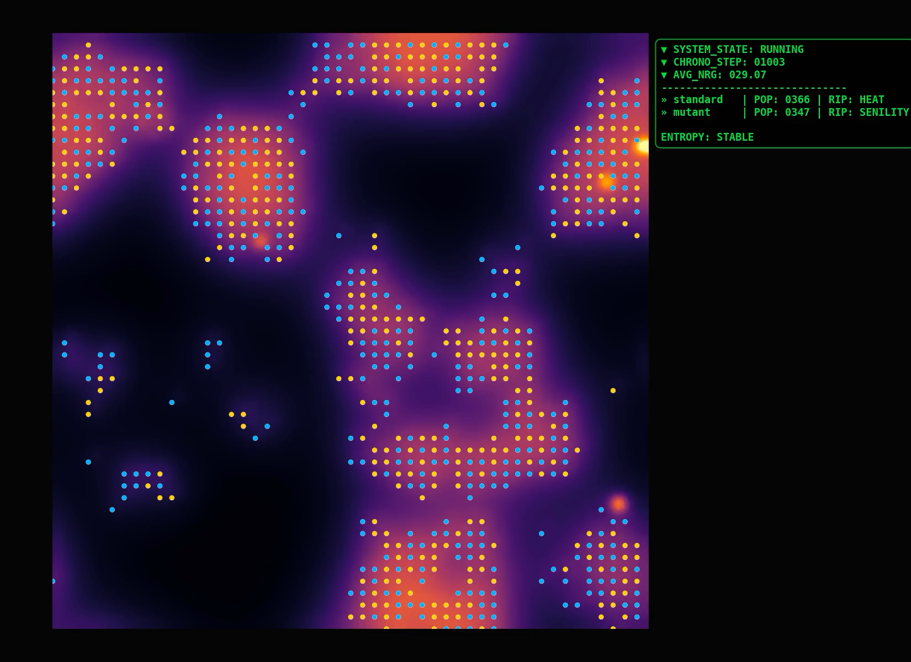

# Persistence vAlpha: The Entropy Audit 

> **"Life is a temporary defiance of the Second Law. This is an appreciation of that defiance."**

_Persistence_ is a high-fidelity Artificial Life (ALife) simulation engine built on the principles of non-equilibrium thermodynamics. Unlike traditional simulations that treat agents as abstract entities, Persistence treats life as a dissipative structure - a temporary pattern of matter that must constantly harvest energy and export entropy to survive. Individual agents in _Persistence_ will inevitably perish but life, as a whole, still tries to **persist**. In this universe, entropy is relentless, physics is closed, biology is stubborn, every atom is accounted for, every joule must be repaid. 


---

## The Core Features

### 1. The Thermodynamic Ledger
Every action has a cost. The simulation maintains a strict global accounting of mass and energy. 
* **Mass Conservation:** Matter is never created or destroyed by life and it's actions; it is only transformed by it.
* **Entropy as Heat:** Life cannot convert matter into energy without generating thermal waste. Every joule of energy borrowed by life is eventually paid back.
External auditors continuously check the universe for any breach in mass and energy conservation.
### 2. Emergence over Intelligence
_Persistence_ serves as a digital laboratory for studying systemic emergence and resilience. Individual agents, by default, are not 'intelligent'. They merely interact with the universe through their genome. Thus, any act of resilience, organization and structure, is completely emergent and not designed.
### 3. You are The Observer, not an Omni-Being
You merely set the constraints of the universe, let genesis happen, kick back and observe. You do not interfere with the universe once you set it in motion.

---
## Project Structure

* `src/`: Core physics (`environment.py`), biology (`biology.py`), the orchestrator 
  (`engine.py`), the logger (`logger.py`)
* `utils/`: Real-time rendering (`viz.py`), post-sim rendering (`render.py`) and data analysis (`plot_results.py`).
* `config.py`: The universal constants for the simulation.
* `main.py` : Entry point 
---
## Installation & Setup

1. Go to your terminal and clone the Repository in your destination folder:
   ```bash
   git clone https://github.com/emergent-complexity/persistence.git
   cd persistence
   ```
2. Create a Virtual Environment.
   ```bash
   python -m venv .venv
   # Activate on Windows:
   .venv\Scripts\activate
   # Activate on Mac/Linux:
   source .venv/bin/activate
   ```
3. Install dependencies
   ```bash
   pip install -r requirements.txt
   ```
## Usage & Execution
1. **Running the Simulation**:
   You can run _Persistence_ in two primary modes. Every run is logged in a unique subfolder within results/ containing all metadata and longitudinal data needed for reproduction.
   
   * **Live Mode**: Real-time visuals of the grid
   ```bash
   python main.py
   ```
   * **Headless Mode**: No visuals; optimized for high-speed data collection and long-term experiments.
   ```bash
   python main.py --headless
   ``` 
2. **Analysis**:
   Use the provided utilities to process and visualize the logged data from your simulation runs
   ```bash
   python utils/plot_results.py results/{your-run-folder}
   ```
   Generated plots will be saved directly into the specific run folder.

3. **Video Rendering** 
   High-quality video rendering requires `ffmpeg`. If you don't have it, download it [here](https://www.ffmpeg.org/download.html)
      * _Timelapse Mode_: Renders the entire simulation based on a fixed frame interval
      ```bash
      python utils/render.py results/{your-run-folder} timelapse <field>
      ```
      * _Event Mode_: Renders a high-resolution window of a specific event.
      ```bash
      python utils/render.py results/{your-run-folder} event <field> [start_step] [duration]
      ```
   The rendered `.mp4` files will be saved in the corresponding run folder.

---

## Hyper-parameters of the simulation (`config.py`)

The `config.py` stores all the hyper-parameters (rules) of the universe. This is how 'The Observer' sets the constraints of the universe. Unless you are planning to modify the simulation, the `config.py` is the only file you need to interact with to set the universe. This file is heavily commented to improve the comprehension of the different parameters. A blog on _Persistence_ , which will have detailed commentary about the parameters, is coming soon. So check back often if you are interested!

---

## Developer's Manifesto

This simulation is the developer's meditative guide on the nature of persistence. The focus is on the exploration of emergent complexity between a species and the world it inhabits, through simple parameters. Nothing is designed, anything that persists, it is because they earned it for a while. Realistic Thermodynamics is implemented in the simulation to maintain fidelity with biological life - a temporary, highly ordered, low entropy organization of matter against the friction of universal disorder through expenditure of energy. 

The reduction of life to such mechanical and intangible terms might seem gloomy and dark, but the simulation actually represents a celebration of life and its fight against entropy. Entropy always wins, but life still tries and that is worth celebrating. 

The simulation naturally dabbles between different relevant themes, including but not limited to, ecology, syntropy, competition, overconsumption, collapse and apocalypse. The Observer is encouraged to notice the parallels between the _Persistence_ universe and ours.

---
## License

Persistence is released under the **GNU GPL v3.0**. You are free to use, modify, and study this code, provided that all derivative works remain open-source under the same license.

---
##  Contact

* **Developer:** persistence-dev@proton.me