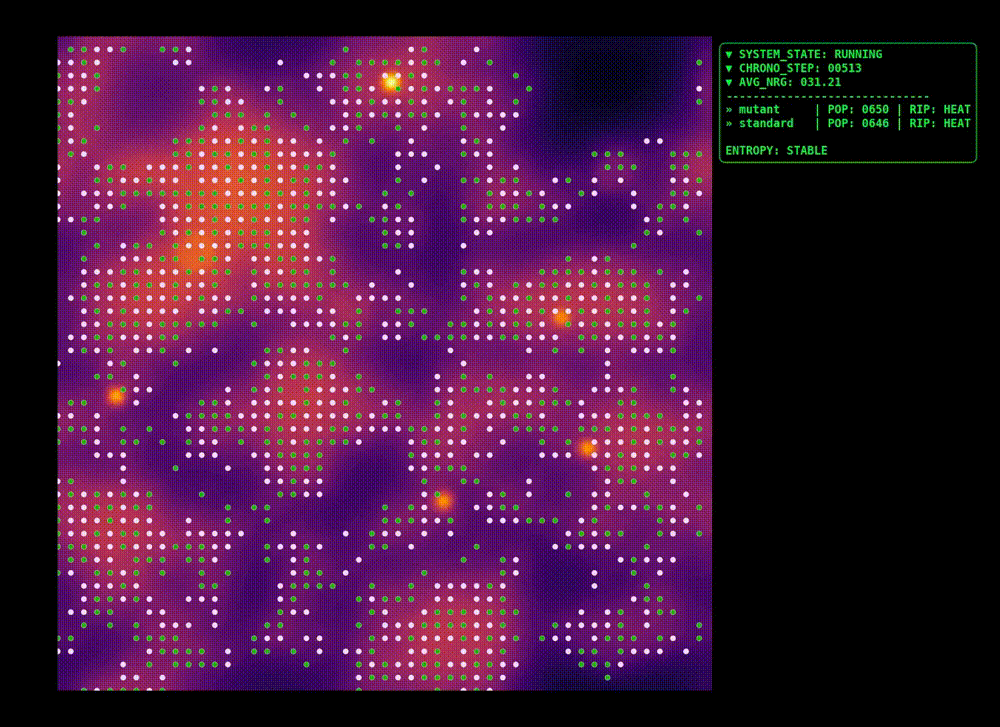
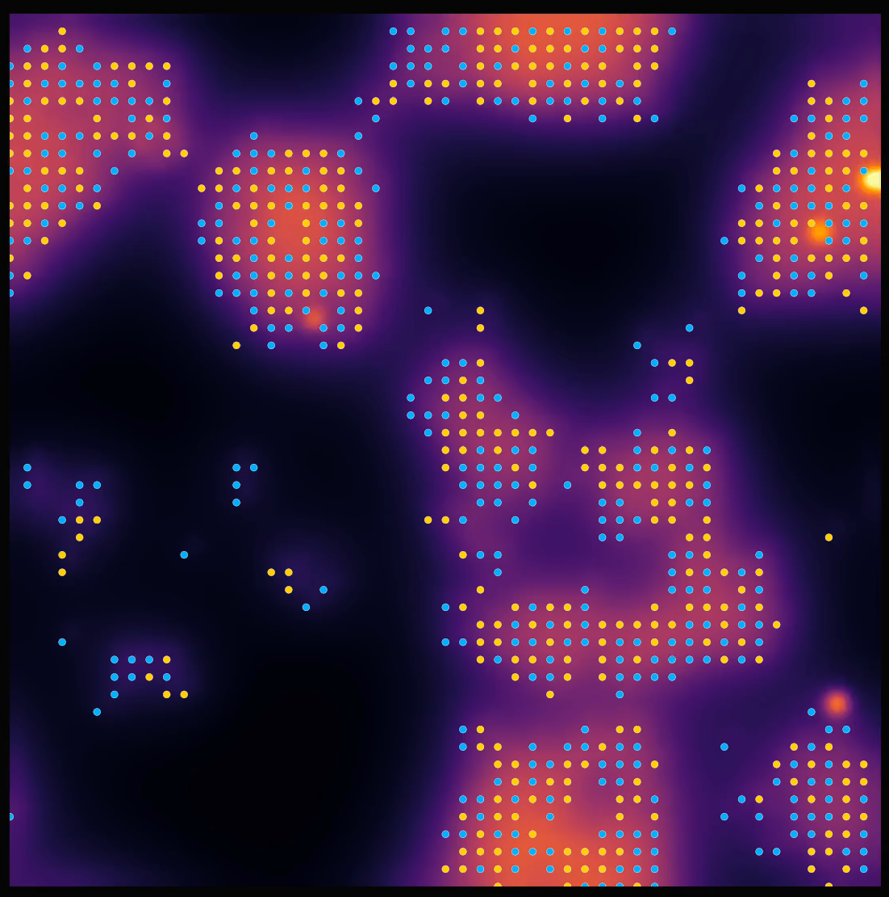
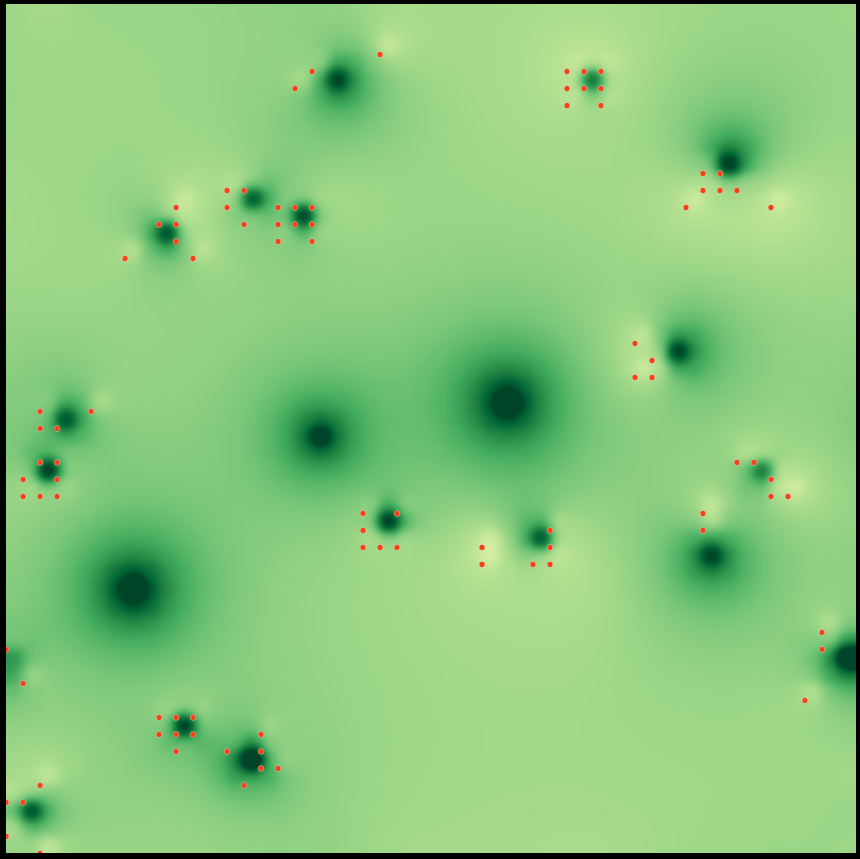
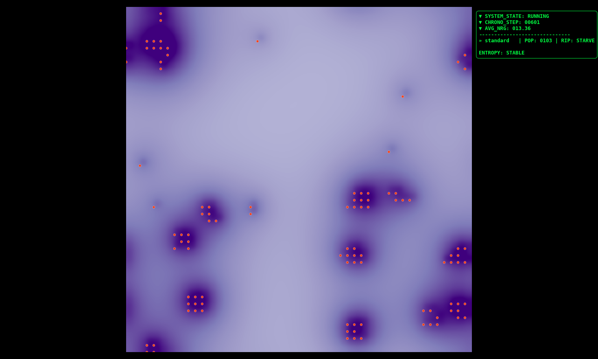
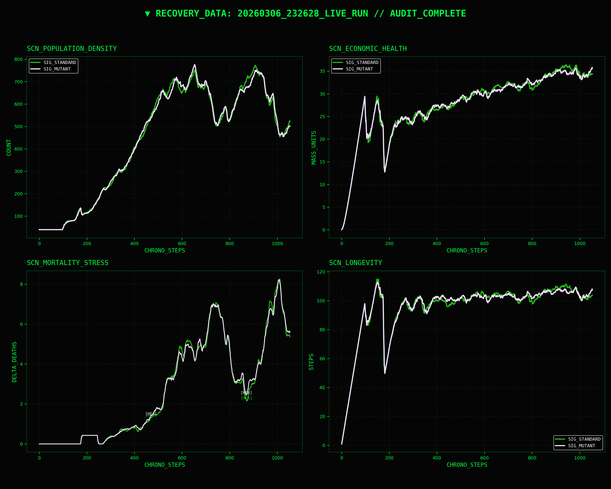

# Persistence
### *An Artificial Life simulation grounded in thermodynamics*

> *"Life is a temporary defiance of the Second Law. This is an appreciation of that defiance."*

[](https://www.python.org/)
[](https://www.gnu.org/licenses/gpl-3.0)
[]()
[](CONTRIBUTING.md)

---



---

## What is this?

**Persistence** is a simulation of life - not a game, not an abstraction, but a physics-honest model of what it means to exist.

Every agent in this world is a **dissipative structure**: a temporary pocket of order that must constantly consume energy and export entropy just to stay alive. It eats, excretes, generates heat, ages, and eventually dies. No agent is coded to be clever. No behavior is designed. Everything you observe — competition, collapse, population booms, extinction cascades — **emerges from the physics alone**.

You are The Observer. You set the rules of the universe. Then you let go.

This project explores themes that matter well beyond biology: **resource scarcity, ecological collapse, overconsumption, resilience, and the stubborn persistence of life against entropy.** Whether you're a scientist, a systems thinker, a philosopher, or just someone who finds these questions fascinating — this simulation is for you.

---

## What will I actually see?

When you run *Persistence*, you'll watch a grid world where:

- Colored **agents** move, feed, reproduce, and die in real time
- A **chemical field** underneath them shows resource concentrations shifting as life consumes and excretes
- A **HUD** tracks population counts, average energy, and leading causes of death per species
- Heat accumulates where life clusters — and kills agents who linger too long

Two visual styles are available:

| `SCIENTIFIC` | `TELEMETRIC` |
|---|---|
| Clean, crisp grid. Good for analysis. | Dark terminal aesthetic. Green-on-black HUD. |

---

## Quickstart

**Requirements:** Python 3.9+, pip

```bash
# 1. Clone the repo
git clone https://github.com/emergent-complexity/persistence.git
cd persistence

# 2. Create and activate a virtual environment
python -m venv .venv
source .venv/bin/activate        # Mac/Linux
# .venv\Scripts\activate         # Windows

# 3. Install dependencies
pip install -r requirements.txt

# 4. Run
python main.py                   # Live mode — opens a window
python main.py --headless        # Headless mode — fast data collection, no window
```

That's it. The simulation starts immediately with the default config.

---

## Scenarios

Not sure where to start? Drop in a pre-configured universe and watch what happens.

| Scenario | Question | File |
|---|---|---|
| 🧫 Self-Inhibiting Species | What if a species is poisoned by its own waste? | `scenarios/self_inhibiting_species.py` |
| 🔄 Metabolic Mirrors | I eat your waste, you eat mine. Can we survive together? | `scenarios/metabolic_mirrors.py` |
| 💥 Boom and Bust | One resource. Two strategies. Who wins? | `scenarios/boom_and_bust.py` |

Each scenario is a complete `config.py` — just copy it to the project root and run.

→ See [scenarios/README.md](scenarios/README.md) for full descriptions and tinkering recommendations.

---

## Exploring the Simulation

### Switching fields during live mode

Press these keys while the simulation is running to change what you're looking at:

| Key | Field shown |
|-----|-------------|
| `1` | Carbon (primary food source) |
| `2` | Waste |
| `3` | Heat field |
| `4` | Necromass (decomposing biomass) |

*(Key bindings are configurable in `config.py`)*

### Analysing a run

After a headless run, results are saved to `results/`. To generate plots:

```bash
python utils/plot_results.py results/<your-run-folder>
```

This produces a 4-panel summary covering population dynamics, stored mass, mortality stress, and longevity.

### Rendering a video

Requires [ffmpeg](https://www.ffmpeg.org/download.html).

```bash
# Timelapse of the full run
python utils/render.py results/<your-run-folder> timelapse carbon

# High-resolution clip around a specific event
python utils/render.py results/<your-run-folder> event carbon <start_step> <duration>
```

---

## Configuring Your Universe

All simulation parameters live in `config.py` — this is the only file you need to touch to change how the universe behaves. It is heavily commented.

A few key levers to start experimenting with:

| Parameter | What it controls |
|---|---|
| `GRID_SIZE` | Size of the world |
| `SPECIES_CONFIGS` | Define species: metabolism, reproduction, tolerances |
| `FIELD_CONFIGS` | Diffusion and decay rates of chemical fields |
| `SOURCES` | Where and how resources enter the world |
| `VISUAL_STYLE` | `'SCIENTIFIC'` or `'TELEMETRIC'` |
| `RANDOM_SEED` | Set to a fixed integer for reproducible runs; `None` for random |

> A full blog post explaining the parameters in depth is coming soon.

---

## Project Structure

```
persistence/
├── src/
│   ├── biology.py       # Agent and Genome — the rules of life
│   ├── environment.py   # Fields, diffusion, decay, resource sources
│   ├── engine.py        # Simulation orchestrator + thermodynamic ledger
│   └── logger.py        # Data logging and run management
├── utils/
│   ├── viz.py           # Real-time visualizer
│   ├── render.py        # Post-run video rendering
│   └── plot_results.py  # Analysis plots
├── scenarios/           # Pre-configured universes to explore
├── tests/               # Physics and biology test suite
├── config.py            # ← Start here. All hyperparameters.
├── main.py              # Entry point
└── results/             # Auto-generated run data
```

---

## The Physics

*Persistence* enforces two conservation laws at every step:

**Mass conservation** — matter is never created or destroyed by life. Agents eat, store, and excrete. When they die, their body mass disperses as necromass into the surrounding cells. An auditor runs periodically to verify the ledger.

**Energy conservation** — every joule of energy metabolised by an agent produces waste heat. That heat diffuses through the environment and radiates away over time. Life borrows order from the universe and pays it back as entropy.

If either law is violated, the simulation flags it immediately.

---

## Tests

The test suite validates that the simulation's physics remain intact — especially useful if you modify the biology or environment and want to verify your universe still makes physical sense.

It covers:
- **Mass conservation** — short runs, long runs, and through full extinction events
- **Energy conservation** — heat accounting across the simulation lifetime
- **Necroburst integrity** — death correctly disperses biomass into the environment
- **Reproduction mass transfer** — births conserve mass between parent and child
- **Biology** — agents age, starve, and die correctly; invalid species configs are rejected
- **Multi-species seeding** — no positional overlap, all species present, occupancy grid consistent

To run:

```bash
pytest tests/
pytest tests/ -v   # verbose output
```

---
## Gallery

| | |
|---|---|
|  |  |
|  |  |

---


## Contributing & Community

*Persistence* is open-source under GPL v3. Contributions, experiments, and ideas are very welcome.

- 💬 **Discussions** — *[link coming soon]* — share runs, ask questions, propose ideas
- 🐛 **Bug reports** — open an issue
- 🔬 **Contributions** — see [CONTRIBUTING.md](CONTRIBUTING.md)
- 📧 **Contact** — [persistence-dev@proton.me](mailto:persistence-dev@proton.me)

Whether you want to fix a bug, design a new species config, write documentation, or just share an interesting run you observed — you're welcome here.

---

## License

Released under the [GNU GPL v3.0](LICENSE). Free to use, study, and modify — derivative works must remain open source.

---

*Entropy always wins. But life still tries. That's worth something.*